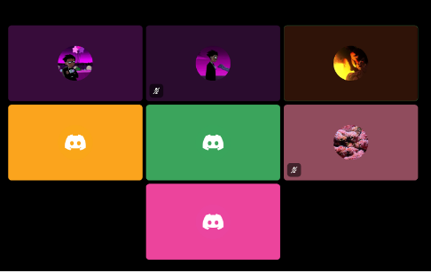
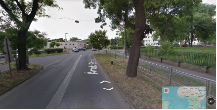

# PhysioApp
> _Note:_ This document will evolve throughout your project. You commit regularly to this file while working on the project (especially edits/additions/deletions to the _Highlights_ section). 
 > **This document will serve as a master plan between your team, your partner and your TA.**

## Product Details
 
#### Q1: What is the product?

A gym app that navigates injuries and turns physiotherapy routines into tailored gym activities.

The problem we're solving is that existing gym apps do not account for user injuries, and physiotherapists often struggle to communicate exercise modifications for injured patients. Our app provides users with personalized workout flows that respect their injuries, allowing them to remain active without risking re-injury. 

Our partner is the Founder of Appyio and currently serves as an IT Project Manager.

The product is a **web application** that:
- Asks users about their injuries and muscle groups to avoid
- Matches users with a tailored 10-, 20-, or 30-minute workout
- Highlights targeted muscles using a cartoon-style visual
- Offers real-time form correction tips and common error alerts

#### Q2: Who are your target users?

- People who are recovering from physical injuries or strains
- Gym-goers who want to continue training safely while injured
- People who lack regular access to a physiotherapist

This set of users spans the 18+ age group of men and women.

#### Q3: Why would your users choose your product? What are they using today to solve their problem/need?

Users today rely on generic gym apps or frequent physiotherapy visits. These solutions are time-consuming, expensive, or not customized for injuries.

Our product:
- Saves time by removing the need for frequent physio visits
- Provides AI-generated routines tailored to injury profiles
- Offers interactive visuals to support proper form
- Supports recovery without compromising fitness 
- Aligns with our partner’s mission to empower users with quickly accessible health technology

#### Q4: What are the user stories that make up the Minumum Viable Product (MVP)?

Below are the main user stories that capture the core functionality of our application:

1. **As a user with an injury**, I want to find exercises that I can still do to either avoid working that injury or to strengthen that injury, depending on my goals.  
   - *Acceptance Criteria:* User is prompted to select injury type/area and is given a tailored exercise plan that avoids or targets the injured muscle group accordingly.

2. **As a user**, I want to see an animated cartoon overlay highlighting the target muscles during each exercise, so that I am confident with the muscle I’m working on.  
   - *Acceptance Criteria:* During each workout, an overlay animation is displayed indicating the targeted muscle group visually.

3. **As a user who lives far from a physiotherapist**, I want to learn new exercises as my injury improves, so that I can get better without physically visiting a physio.  
   - *Acceptance Criteria:* The app adapts exercise difficulty over time and suggests new exercises based on previous activity and recovery stage.

4. **As a user**, I want to see a log of past exercises I have done to track my fitness progress.  
   - *Acceptance Criteria:* Users can view a chronological list of past workouts, including duration and targeted areas.

5. **As a logged-in user**, I want to specify which equipment (gym or home) I have access to so that the exercise suggestions are relevant to what I can actually perform.  
   - *Acceptance Criteria:* Users select equipment during onboarding or profile edit, and exercise plans are filtered accordingly.

6. **As a user**, I want to receive AI-generated exercise plan recommendations based on my profile information, past injuries, and available equipment.  
   - *Acceptance Criteria:* The app generates custom workout flows using AI logic that factors in injury data, goals, and available tools.

7. **As a user**, I want to have a chatbot to ask relevant questions about exercise plans, so I can get real-time guidance without contacting a physiotherapist.  
   - *Acceptance Criteria:* A chatbot interface allows users to ask injury- or workout-related questions and receive responses from an integrated AI model.

#### Q5: Have you decided on how you will build it? Share what you know now or tell us the options you are considering.

**Technology Stack**:
- **Frontend**: React.js – Chosen for its flexibility, strong ecosystem, and suitability for building dynamic web UIs.
- **Backend**: Java with Spring Boot – A mature and scalable backend framework with strong support for RESTful APIs, security, and dependency injection.
- **Database**: PostgreSQL – Hosted using AWS RDS to provide managed database infrastructure with automatic backups and scaling.
- **Deployment**: We are considering AWS Amplify or Beanstalk for full-stack deployment, but may also evaluate Render for simplicity and cost-effectiveness in hosting both frontend and backend services.
- **Authentication**: We plan to use Spring Security with JWT for token-based auth. AWS Cognito is a possible alternative if we decide to offload authentication management to a third-party service.
- **AI Integration**: Hugging Face's Mistral-7B API – We will use this to power the chatbot and possibly generate intelligent exercise recommendations, as requested by the partner.
- **Containerization**: Docker – To create consistent development environments and simplify deployment by bundling all dependencies into portable containers.
- **Monitoring**: Prometheus + Grafana – For tracking application performance, uptime, and user metrics.

**Architecture**:
- The app will follow a microservices-friendly, component-based architecture:
  - The frontend communicates with the backend via REST APIs.
  - Backend services include modules for user management, exercise recommendation, injury-based filtering, and AI interactions.
  - The PostgreSQL database stores user data, exercise history, and injury profiles.
  - Authentication and authorization are handled via secured endpoints using JWT or Cognito tokens.
  - AI endpoints (e.g., for the chatbot) interact with external APIs like Hugging Face.

**Third-Party APIs and Tools**:
- Hugging Face (for AI)
- AWS services (RDS, Cognito, Amplify/Beanstalk)
- GitHub for version control and collaboration
- Jira for sprint and issue tracking
- Docker Hub for container registry

----
## Intellectual Property Confidentiality Agreement 
We have agreed with our partner that we will not share the code outside the scope of this course, except when discussing academic experience (e.g., during interviews).
----

## Teamwork Details

#### Q6: Have you met with your team?

Yes, we met as a team on Discord where we introduced ourselves and talked about our backgrounds, interests, and strengths related to software development. This helped us understand how to best collaborate and divide responsibilities moving forward.

As a team-building activity, we played **GeoGuessr**, a game where players guess real-world locations using Google Street View. It was a fun way to work together and build rapport through problem-solving and teamwork.

**Screenshots from our team meeting and activity:**

  
*Our virtual team meeting on Discord.*

  
*Screenshot from our team game of GeoGuessr.*

**Three fun facts about our team:**
- **Anuj** is ranked in the top 5000 globally in *Rocket League*.
- **Hamed** has traveled to over 15 countries.
- **Abishek** is currently interning at *Manulife*.

#### Q7: What are the roles & responsibilities on the team?

Describe the different roles on the team and the responsibilities associated with each role. 
 * Roles should reflect the structure of your team and be appropriate for your project. One person may have multiple roles.  
 * Add role(s) to your Team-[Team_Number]-[Team_Name].csv file on the main folder.
 * At least one person must be identified as the dedicated partner liaison. They need to have great organization and communication skills.
 * Everyone must contribute to code. Students who don't contribute to code enough will receive a lower mark at the end of the term.

List each team member and:
 * A description of their role(s) and responsibilities including the components they'll work on and non-software related work
 * Why did you choose them to take that role? Specify if they are interested in learning that part, experienced in it, or any other reasons. Do no make things up. This part is not graded but may be reviewed later.

*Mohammed Hussain* - Front and back-end developer, scrum master, API testing, writing documentation about our code, developing UI

*Anuj Sarvate* - Front and back-end developer, development manager, API testing, developing UI 

*Satyam Kaushik* - Front and back-end developer, product manager, writing documentation about code

*Yuxin Li* - Front and back-end developer, scrum master, API testing 

*Ruike Hou* - Front and back-end developer, development manager, ensuring code formatting is followed, developing UI 

*Hamed Dawoudzai* - Front and back-end developer, development manager, researching tech stack

*Abhishek Sharma* (partner liaison)  - Front and back-end developer, product manager, researching tech stack 

Everyone was given roles according to their strengths and past experiences. Everyone has past experience with full-stack development and expressed interest in working in this capacity on the project. All members assigned API testing and writing documentation wanted to develop this skillset further. Scrum masters wanted to gain more experience with navigating group disagreements. Product and development managers gained these skills through their internships and desired to further develop them. 

#### Q8: How will you work as a team?

- **Weekly Meetings:** On Discord, once per week, serving as weekly scrums
- **Ad hoc sessions:** Extra check-ins if blockers or questions arise
- **Partner Meetings:** Only one so far (partner was on vacation). Expectations and goals were discussed.
- **Minutes:** Saved in `deliverables/minutes` folder
  
#### Q9: How will you organize your team?

**Tools & Artifacts:**
- Jira for sprint planning and task tracking
- Discord for communication
- GitHub for code collaboration and reviews
- Meeting minutes stored in repo

**Work Organization:**
- Tasks assigned based on skill/role
- Prioritized in Jira board
- Regular reviews and updates during scrums

#### Q10: What are the rules regarding how your team works?

**Communication:**
- Discord for daily communication
- Email + Zoom for partner updates
- Partner liaison responsible for external communication with partner through email

**Collaboration & Accountability:**
- All meetings will be logged and attendance tracked
- Missed action items followed up by a team member
- If a member is unresponsive, reach out 1-on-1 first, escalate to TA if unresolved
  
## Organisation Details

#### Q11. How does your team fit within the overall team organisation of the partner?

We are playing a **product development** role. The partner provided a broad concept and some code base, but we are independently creating the MVP and all required features from scratch so that we can work with a stack we are more comfortable with.

This is appropriate as we have members with experience in full-stack development and system design.

#### Q12. How does your project fit within the overall product from the partner?

We are building **Stage 1** of the product: a fully functional MVP that the partner can use to attract future clients and physio collaborators.

- We are starting from scratch (not using existing prototype/code)
- We are responsible for both the frontend and the backend
- We will implement a core set of features given to us by the partner, along with a few extra features that we think would be beneficial
- Future stages (e.g., gamification, partnering with actual physiotherapists) are not part of this iteration of CSC 301
- Success = Fully working MVP with core user stories and partner feedback integrated
  
## Potential Risks

#### Q13. What are some potential risks to your project?

- **AI Integration Uncertainty**: The partner wants AI but left implementation up to us.
- **Feature Overload**: Risk of trying to implement too many features before the deadline.
- **Unfamiliar Tech Stack**: Some members are new to some aspects of the tech stack.
- **Coordination Delays Between Team Members**: Missed updates or inconsistent participation can impact delivery.

#### Q14. What are some potential mitigation strategies for the risks you identified?

- **Clarify AI Goals**: Set up a meeting with the partner to refine AI expectations before we implement any AI.
- **Feature Prioritization**: Identify core MVP features, treat others as stretch goals.
- **Early Learning and Task Assigning**: Have regular meetings early on where group members can learn the stack with each other. Also, only assign tasks to group members that they feel confident doing.
- **Frequent Syncs**: Weekly meetings with structured agendas and progress check-ins to ensure everyone is always on the same page. Also, message communication on Discord for small everyday check-ins. 
